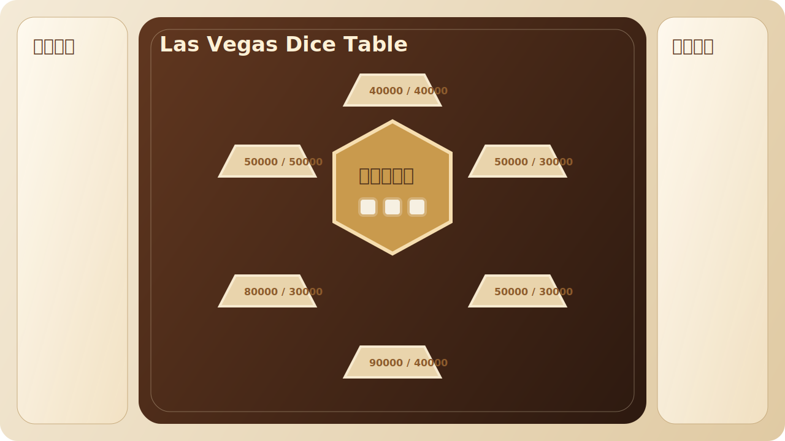
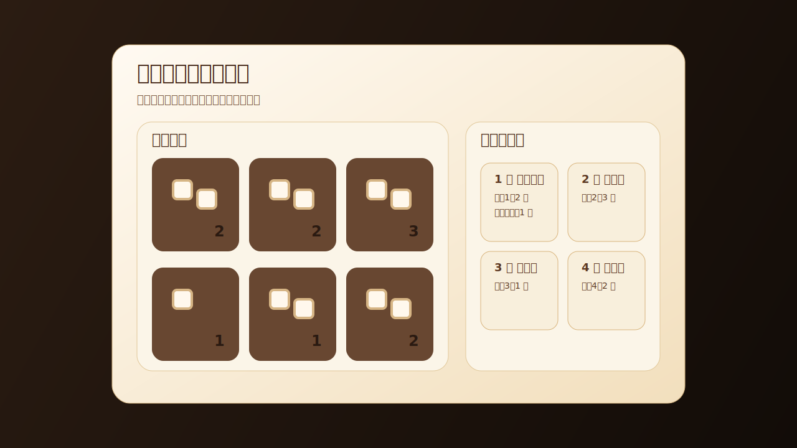
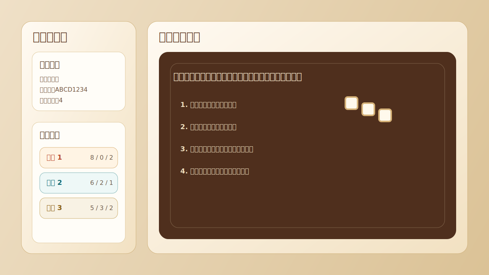

# Las Vegas Dice Table

A web-based Las Vegas-style tabletop dice game built with `Three.js + Vite + Trystero`, supporting both local multiplayer and LAN online play.

## Preview





## Features

- Supports 2 to 6 players
- 3D board, 3D dice, and 3D coin presentation
- LAN multiplayer room support
- Seat selection, player renaming, and synced actions
- Built-in mini games: `Muddy the Waters`, `Heads or Tails`, `High / Equal / Low`
- Reroll token system and final settlement

## How to Play

### Core Flow

1. Each player starts with `8` standard six-sided dice and `2` reroll tokens.
2. On your turn, click the central hex area on the table to roll.
3. From the rolled result, choose one face value and place all dice showing that value into the matching zone.
4. If you are not satisfied with the roll, you may spend `1` reroll token to reroll the remaining dice.
5. When all players have placed all of their dice, the game enters final settlement.

### Zone Rules

- There are `6` placement zones on the board.
- Zones `1 / 2 / 3` are special game zones that trigger mini games.
- Zones `4 / 5 / 6` are normal base zones.
- Only unique dice counts are considered valid in each zone.
- If two or more entries in the same zone have the same dice count, all matching counts are canceled.
- Final rewards are assigned by valid count ranking from highest to lowest.

### Reward Table

| Face | Zone | 1st Place | 2nd Place |
| --- | --- | ---: | ---: |
| 1 | Muddy the Waters | 40000 | 40000 |
| 2 | Heads or Tails | 50000 | 30000 |
| 3 | High / Equal / Low | 50000 | 30000 |
| 4 | Base Zone | 90000 | 40000 |
| 5 | Base Zone | 80000 | 30000 |
| 6 | Base Zone | 50000 | 50000 |

## Mini Game Rules

### Face 1: Muddy the Waters

- This mini game uses a shared set of pollution dice piles with the initial counts:

```text
[2, 2, 3, 1, 1, 2]
```

- A player may drag one pollution pile into any target zone.
- All pollution dice belong to one virtual entry called `Interference Dice`.
- `Interference Dice` only affects duplicate-count validation and never participates in final reward ranking.
- Each pile can only be used once per match. Once consumed, it will not appear again.

### Face 2: Heads or Tails

- The player guesses whether the coin will land on `Heads` or `Tails`.
- Up to `3` attempts are allowed.
- Each correct guess grants `20000`.
- If the player guesses wrong, all rewards earned in this mini game are reset to `0`.
- The player may cash out and leave the mini game at any time.

### Face 3: High / Equal / Low

- At the start, `2` dice are rolled to create the initial reference total.
- On each step, the player may guess:
  - Higher
  - Equal
  - Lower
- A correct guess advances to the next step, and the player may also cash out at any time.
- Reward progression:

```text
[5000, 8000, 15000, 30000, 50000, 80000]
```

### Reroll Tokens

- Each player starts with `2` reroll tokens.
- Spending `1` token allows the player to reroll the current remaining dice after a roll.
- At the end of the match, each unused reroll token is converted into `10000`.

## Online Multiplayer

- The host can create a room and share the room URL with other players.
- Guests can choose seats, rename themselves, and act during their own turns.
- The current networking setup is intended for LAN or HTTPS-enabled environments.

## Local Development

### Install Dependencies

```bash
npm install
```

### Development Mode

```bash
npm run dev
```

Or use LAN access:

```bash
npm run dev:host
```

Default local address:

```text
http://localhost:5173
```

### HTTPS Development

```bash
npm run dev:https
```

### Production Build

```bash
npm run build
```

### Preview Build Output

```bash
npm run preview
```

## Project Structure

```text
LasVegasDesktop/
├─ index.html
├─ package.json
├─ vite.config.js
├─ src/
│  ├─ main.js
│  └─ styles.css
└─ docs/
   └─ screenshots/
```

## Tech Stack

- `Three.js`
- `Vite`
- `Trystero`
- Vanilla `JavaScript / HTML / CSS`

## Repository

- GitHub: [https://github.com/fu731033719/LasVegasDiceTable](https://github.com/fu731033719/LasVegasDiceTable)
